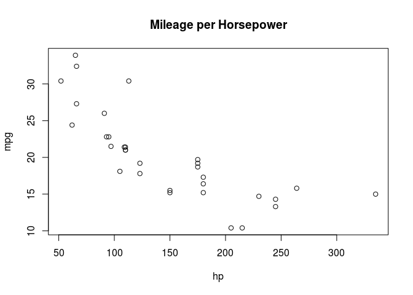

Introduction to R Markdown
================
Tiberius
9 July 2016

Markdown is a simple formatting syntax for authoring HTML, PDF, and MS Word documents. For more details on using R Markdown see <http://rmarkdown.rstudio.com>.

Using the **rmarkdown** package (*pandoc* version 1.12.3 or higher is required), the rendering command is

``` r
rmarkdown::render("your rmd file")
```

The default is HTML output (because *output* has been specified as such in the heading of the current document). If you would like a markdown (.md) or github (to include graphics) document, add an argument:

``` r
rmarkdown::render("your rmd file", md_document())
rmarkdown::render("your rmd file", github_document())
```

------------------------------------------------------------------------

The same way, PDF output (*pdflatex* is needed, that is *texlive-base*, *texlive-latex-base*, *texlive-latex-extra*, and *texlive-fonts-recommended*):

``` r
rmarkdown::render("your rmd file", pdf_document())
```

or OpenOffice or Word document:

``` r
rmarkdown::render("your rmd file", odt_document())
rmarkdown::render("your rmd file", word_document())
```

or *beamer* (PDF) or *slidy* (HTML) presentation:

``` r
rmarkdown::render("your rmd file", beamer_presentation())
rmarkdown::render("your rmd file", slidy_presentation())
```

------------------------------------------------------------------------

When the document is generated that includes both content as well as the output of any embedded R code chunks within the document. You can embed an R code chunk like this:

``` r
summary(mtcars)
```

    ##       mpg             cyl             disp             hp       
    ##  Min.   :10.40   Min.   :4.000   Min.   : 71.1   Min.   : 52.0  
    ##  1st Qu.:15.43   1st Qu.:4.000   1st Qu.:120.8   1st Qu.: 96.5  
    ##  Median :19.20   Median :6.000   Median :196.3   Median :123.0  
    ##  Mean   :20.09   Mean   :6.188   Mean   :230.7   Mean   :146.7  
    ##  3rd Qu.:22.80   3rd Qu.:8.000   3rd Qu.:326.0   3rd Qu.:180.0  
    ##  Max.   :33.90   Max.   :8.000   Max.   :472.0   Max.   :335.0  
    ##       drat             wt             qsec             vs        
    ##  Min.   :2.760   Min.   :1.513   Min.   :14.50   Min.   :0.0000  
    ##  1st Qu.:3.080   1st Qu.:2.581   1st Qu.:16.89   1st Qu.:0.0000  
    ##  Median :3.695   Median :3.325   Median :17.71   Median :0.0000  
    ##  Mean   :3.597   Mean   :3.217   Mean   :17.85   Mean   :0.4375  
    ##  3rd Qu.:3.920   3rd Qu.:3.610   3rd Qu.:18.90   3rd Qu.:1.0000  
    ##  Max.   :4.930   Max.   :5.424   Max.   :22.90   Max.   :1.0000  
    ##        am              gear            carb      
    ##  Min.   :0.0000   Min.   :3.000   Min.   :1.000  
    ##  1st Qu.:0.0000   1st Qu.:3.000   1st Qu.:2.000  
    ##  Median :0.0000   Median :4.000   Median :2.000  
    ##  Mean   :0.4062   Mean   :3.688   Mean   :2.812  
    ##  3rd Qu.:1.0000   3rd Qu.:4.000   3rd Qu.:4.000  
    ##  Max.   :1.0000   Max.   :5.000   Max.   :8.000

------------------------------------------------------------------------

You can also embed plots, for example:



Note that the `echo = FALSE` parameter was added to the code chunk to prevent printing of the R code that generated the plot.
